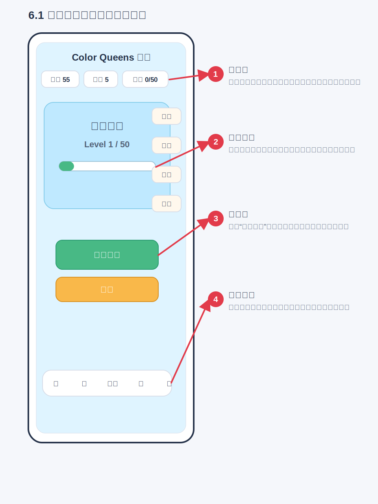
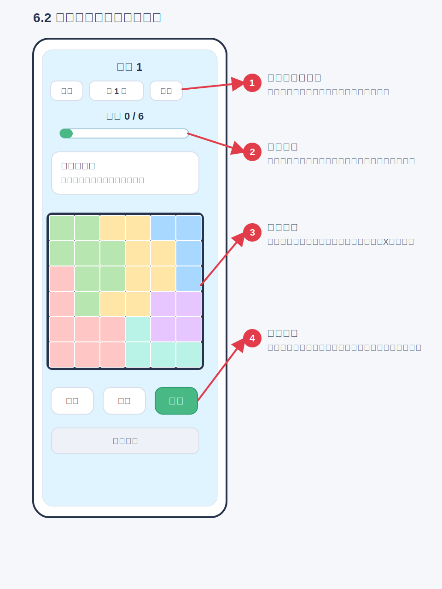
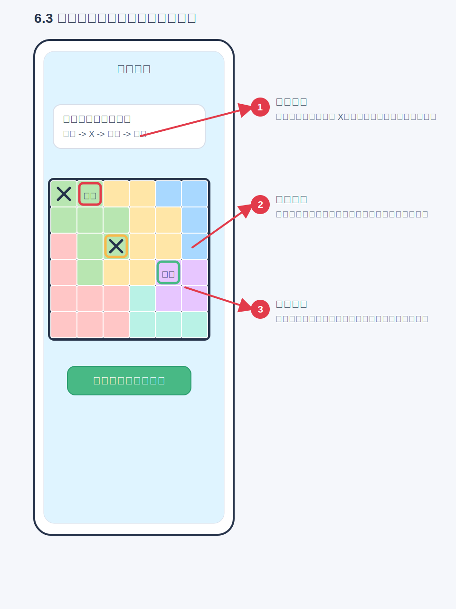
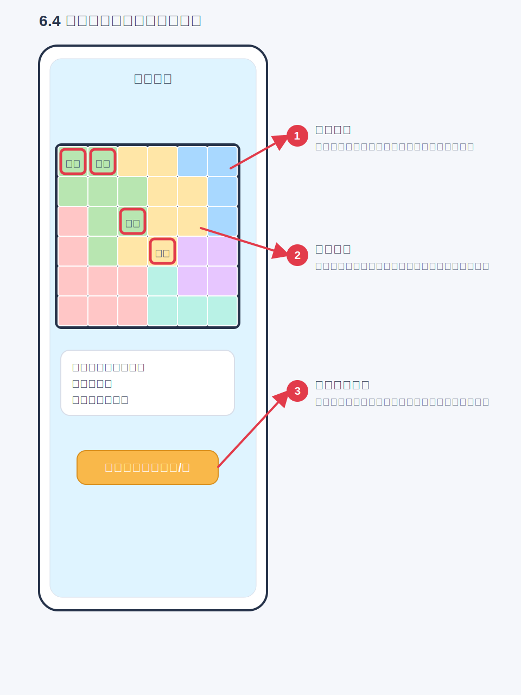
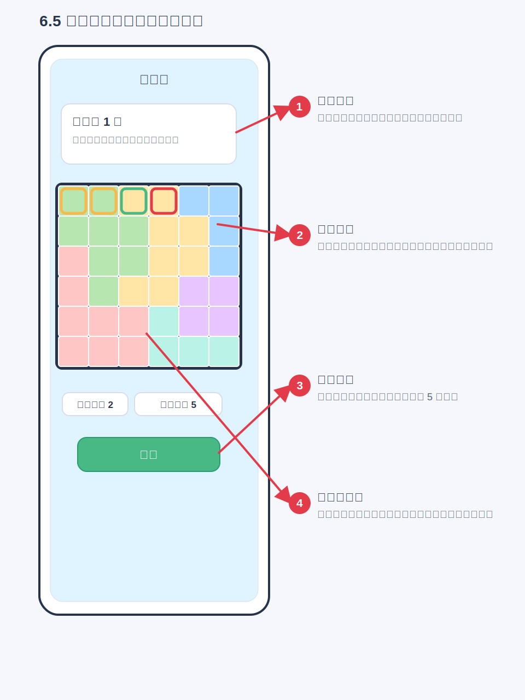
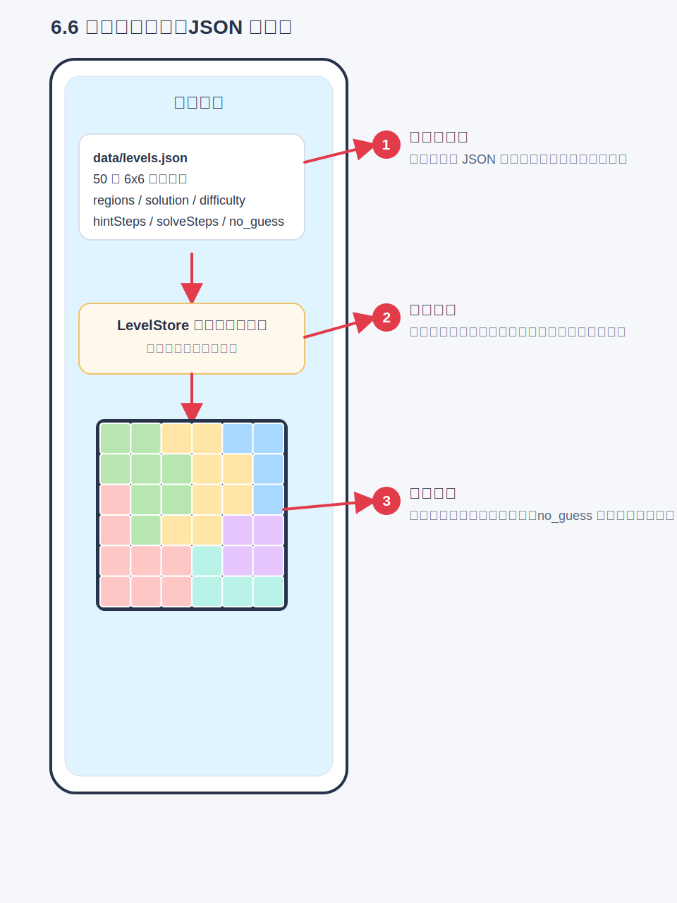
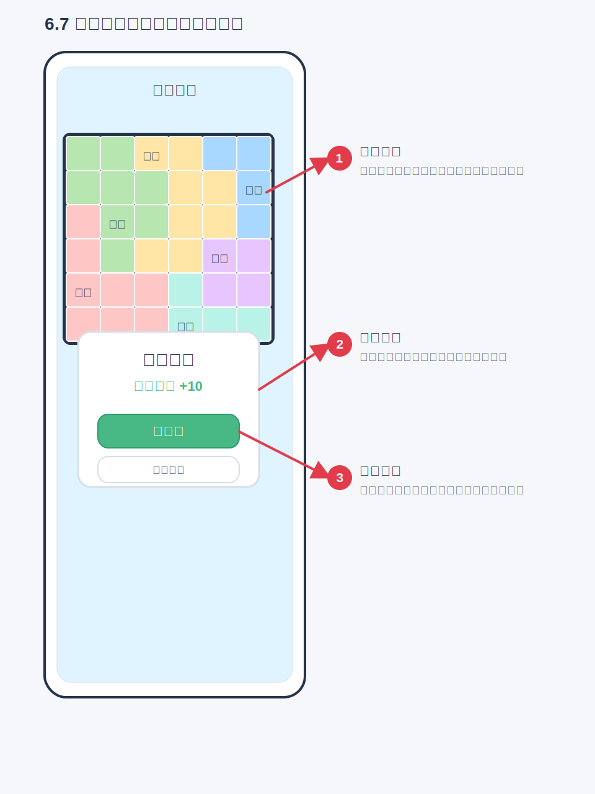
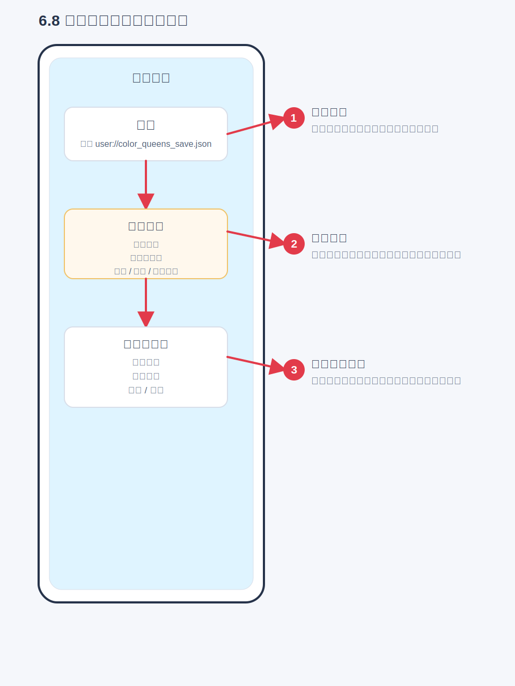

# Color Queens 产品需求文档

最后更新：2026-07-08  
适用分支：`codex-iteration`  
当前阶段：Godot MVP

## 1. 文档目的

本文档用于记录 Color Queens 当前产品范围、功能模块、功能逻辑、实现原理和回归测试要求。后续每次功能迭代都必须同步更新本文档，并在正式发布前按本文档执行测试回归。

本文档是项目的产品事实源：

- 新增功能时，先补充或更新对应模块说明。
- 修改玩法、经济、界面、关卡或提示逻辑时，同步更新受影响模块。
- 发布前，以“回归测试清单”为准逐项验证。

## 2. 产品概述

Color Queens 是一款竖屏移动端休闲逻辑谜题。玩家在彩色区域棋盘中找出所有皇冠，需要同时满足四条规则：

- 每一行有且仅有一个皇冠。
- 每一列有且仅有一个皇冠。
- 每个颜色区域有且仅有一个皇冠。
- 皇冠不能八方向相邻。

当前产品参考 Royal Match / Magic Sort 的休闲闯关外壳，但核心玩法保持 Queen / Star Battle 类逻辑谜题，不改为倒水、三消或排序玩法。

## 2.1 项目核心约束

以下约束优先级高于普通 UI 和数值调优；后续实现、测试和验收都必须遵守。

### 2.1.1 核心玩法逻辑

- 核心目标是让用户从棋盘格子中找出所有皇冠。
- 每一行、每一列、每个颜色区域都必须有且仅有一个皇冠。
- 皇冠之间不能挨着，任意两个皇冠不能出现在八方向相邻格。
- 用户可以对格子做两类判断：标记皇冠、标记排除。
- 通关判断必须基于上述规则，不能只依赖预设答案坐标。

### 2.1.2 核心棋盘交互

- 一般情况下，格子初始状态为空。
- 单击空格表示排除该格，格子显示 X。
- 再次单击已排除格表示取消排除，格子恢复为空。
- 按住并滑过多个可标记格时，应批量处理普通排除 X：从空格开始滑动时连续标记普通 X，从普通 X 开始滑动时连续取消普通 X。
- 双击空格表示标记皇冠。
- 如果双击格是正确答案，应触发一次震动反馈，并显示皇冠。
- 如果双击格不是正确答案，应触发一次震动反馈，并显示红色 X。
- 红色 X 表示错误尝试结果，不可取消，也不可通过撤销恢复。
- 滑动操作只能处理普通排除 X，不能标记皇冠，不能改变皇冠、提示皇冠或红色 X；一次滑动开始时决定是标记模式还是取消模式，过程中不来回翻转。
- 普通排除 X 可以取消；红色 X 和普通排除 X 必须有清晰视觉区别。

### 2.1.3 棋盘颜色

- 棋盘颜色需要鲜明、容易区分。
- 相邻颜色区域不应使用相近颜色，避免玩家难以辨认边界。
- 默认色板固定使用“明亮经典”10 色：`#E53935`, `#1E88E5`, `#43A047`, `#FDD835`, `#8E24AA`, `#00ACC1`, `#FB8C00`, `#3949AB`, `#7CB342`, `#D81B60`。
- 当前正式关卡最多使用 9 个颜色区域，第 10 个粉色作为后续 10 区域关卡预留；当前 5x5-9x9 正式关卡使用前 9 色。

## 3. 目标用户与体验方向

目标用户是偏休闲的逻辑谜题玩家。产品体验目标：

- 上手轻：通过首页、关卡、提示和即时纠错降低理解成本。
- 逻辑清楚：提示要解释“为什么”，不能只告诉玩家答案。
- 节奏短：单关 6x6，适合碎片化游玩。
- 可持续迭代：关卡、提示、经济和主界面可以逐步扩展。

## 4. 当前版本范围

已实现：

- 休闲闯关首页。
- 5x5 到 9x9 Color Queens 棋盘玩法。
- 1670 个默认关卡，覆盖 5x5 到 9x9。
- 难度标记：新手、普通、困难、专家。
- 无猜解题路径数据：`logicStatus`、`hintSteps`、`solveSteps`。
- 教学提示：单候选、候选锁定、成组锁定、反证排除、直接冲突排除。
- 金币、提示次数、通关奖励。
- 本地存档。
- Godot 冒烟测试和新手教程冒烟测试。

未完成或占位：

- 生命系统目前只展示固定数值。
- 排行榜、活动、队伍、商店、宝箱为占位入口。
- 广告位为 Demo Placeholder。

## 5. 信息架构

主要页面：

- 首页：主视觉、开始关卡、新人流程入口。
- 新手引导教程：首次进入第一关前，用单张 5x5 教程棋盘图串联双击找皇冠、滑动排除、同行同列排除、提示线索和通关目标。
- 关卡页：棋盘、规则提示、选关、撤销、清除、提示。
- 通关弹窗：通关反馈、金币奖励、下一关、重玩本关。

核心数据：

- `data/levels.json`：关卡配置、答案、难度、提示路径和无猜解题路径。
- `user://color_queens_save.json`：本地存档。
- 新手引导完成状态应写入本地存档，用于决定后续是否直接进入正式关卡。

## 6. 模块需求

### 6.1 首页模块

用户目标：明确当前在 Color Queens 主界面，看到主视觉和最核心入口，一键进入当前关卡；开发/验收时可快速模拟新人流程。

功能逻辑：

- 首屏显示 sky/garden/lake/path 风格背景和 Color Queens 主视觉。
- 首页不显示顶部金币、生命、星数、设置按钮。
- 首页不显示左侧每日奖励、宝箱入口。
- 首页不显示右侧活动、排行榜入口。
- 首页不显示底部星、杯、主页、队、设导航。
- 中下部只显示“开始关卡”和“新人流程”按钮。
- 首页进度根据当前关卡和已完成关卡数更新。
- “新人流程”按钮用于验收和调试，点击后模拟新用户状态，重新进入新手引导教程。

当前实现：

- UI 由 `scripts/main.gd` 中 `_build_home_screen()` 及其子函数动态构建。
- 首页主操作由 `_build_home_primary_buttons()` 构建。
- “开始关卡”调用当前关卡流程；“新人流程”调用 `_simulate_new_user_flow()` 重置教程完成状态并进入教程。
- 资源、活动、排行榜、宝箱和底部导航入口已从首页隐藏。

功能截图与交互流转：



回归测试重点：

- 点击开始关卡进入关卡页。
- 点击新人流程会重新进入新手引导。
- 首页不显示金币、生命、星数、左侧入口、右侧入口和底部导航。

### 6.2 关卡页模块

用户目标：完成当前关卡，清楚知道关卡进度、剩余操作和规则反馈。

功能逻辑：

- 顶部栏包含返回首页和“选关”按钮；不显示生命、设置或其它右上角按钮。
- 关卡标题只显示关卡编号，不显示关卡名称。
- “选关”按钮打开关卡选择弹窗，用户确认后直接切换到所选正式关卡。
- 教练提示区显示关卡教程或当前提示解释。
- 棋盘占据主要空间，正式关卡底部为撤销、清除、提示按钮。
- 底部不显示广告占位。

当前实现：

- UI 由 `scripts/main.gd` 中 `_build_game_screen()` 及其子函数构建。
- 冲突状态由 `_validate_and_update()` 更新。
- 顶部编辑、设置、红心和底部广告入口已从关卡页移除，保留“选关”入口用于切换正式关卡。
- 新手教程棋盘会覆盖首页，不显示正式关卡的帮助问号、选关入口和进度条。

功能截图与交互流转：



回归测试重点：

- 页面在移动端宽度下按钮和棋盘不溢出。
- 关卡页不显示金币、红心、排行榜、编辑、设置和广告。
- 点击“选关”可打开选择弹窗，并能进入所选关卡。
- 关卡标题只显示关卡编号。
- 新手教程棋盘不显示正式关卡标题、帮助问号、选关入口和进度条。

### 6.3 棋盘交互模块

用户目标：通过点击格子标记排除，通过双击格子尝试找出皇冠，直观看到颜色区域、皇冠、普通 X、红色 X、冲突和提示高亮。

功能逻辑：

- 单击空格标记普通排除 X。
- 再次单击普通排除 X 取消标记，恢复为空格。
- 单击皇冠、提示皇冠或红色 X 不改变格子状态。
- 按住并从空格开始滑动时，沿途空格连续标记为普通排除 X。
- 按住并从普通 X 开始滑动时，沿途普通 X 连续取消为空格；滑动经过皇冠、提示皇冠或红色 X 时保持原状态。
- 双击空格或普通排除 X 尝试标记皇冠。
- 双击正确答案格时，触发震动反馈并显示皇冠。
- 双击非答案格时，触发震动反馈并显示红色 X。
- 红色 X 不可取消，也不可通过撤销或清除恢复。
- 棋盘支持鼠标点击和触屏点击。
- 有冲突时冲突格变红。
- 提示时显示观察范围、候选、排除和建议格。
- 操作后提供轻量动画反馈。

当前实现：

- 交互状态由 `scripts/main.gd` 中 `cell_states` 管理，状态包括 `empty`、`blocked`、`piece`、`hint`、`wrong`。
- 棋盘绘制由 `scripts/game_board.gd` 自绘完成。
- `GameBoard` 通过 `cell_pressed(row, col)`、`cell_double_pressed(row, col)`、`cell_drag_started(row, col)`、`cell_dragged(row, col)`、`cell_drag_ended()` 信号把点击、双击和滑动传回主逻辑。
- 高亮类型包括 `unit`、`candidate`、`exclude`、`place`。
- `play_cell_feedback()` 和 `play_guide_feedback()` 提供格子反馈动画。

功能截图与交互流转：



回归测试重点：

- 第一次点击为空格标记 X。
- 第二次点击同格取消普通 X。
- 按住从空格开始滑动可连续标记普通 X；按住从普通 X 开始滑动可连续取消普通 X；两种滑动都不会影响皇冠或红色 X。
- 双击正确答案格显示皇冠并触发反馈。
- 双击非答案格显示不可撤销、不可清除的红色 X 并触发反馈。
- 普通 X、红色 X、皇冠、高亮和冲突图形可见且不遮挡棋盘。
- 棋盘在不同窗口尺寸下保持正方形比例。

### 6.4 规则与冲突模块

用户目标：放错时能及时知道哪里违反规则。

功能逻辑：

- 任意两个皇冠如果同行、同列、同颜色区域或八方向相邻，则视为冲突。
- 开启即时纠错时，冲突格高亮。
- 即时纠错当前为内部开关，不提供前端设置入口。

当前实现：

- `_find_conflicts()` 遍历当前皇冠位置并检查四类冲突。
- `_validate_and_update()` 负责刷新错误状态、进度和教练提示。
- `immediate_errors` 控制是否显示即时错误。

功能截图与交互流转：



回归测试重点：

- 同行、同列、同区域、相邻两个皇冠均显示冲突。
- 关闭即时纠错后不显示红色冲突，但通关仍要求无冲突。

### 6.5 提示模块

用户目标：获得当前最值得判断的一步，并理解为什么可以选择或排除。

功能逻辑：

- 提示不直接替玩家找出皇冠。
- 提示消耗免费次数；免费次数用完后消耗金币。
- 免费提示初始为 3 次。
- 金币提示成本为 5。
- 提示给出文字解释和棋盘高亮。
- 提示应优先给出可以推进棋盘的逻辑判断。

当前提示策略顺序：

1. 单元唯一候选：某行、列或颜色区域只剩一个合法候选。
2. 候选锁定：某单元候选全部落在另一单元内，可排除另一单元其它候选。
3. 成组锁定：多个单元共同锁定一组行、列或颜色区域，可排除组外候选。
4. 反证排除：如果某格是皇冠，会导致某个单元没有任何可找皇冠的位置。
5. 直接冲突排除：已有皇冠导致某格必然冲突。
6. 候选关注：没有确定推进时，提示值得比较的候选范围。

当前实现：

- `_use_hint()` 执行提示消耗、设置高亮和更新教练文本。
- `_build_best_next_hint()` 负责选择当前最佳提示。
- 相关策略函数集中在 `scripts/main.gd` 的提示逻辑区。
- 区域名称由 `REGION_COLOR_NAMES` 转换为可见颜色名，例如黄色区域、绿色区域。
- 关卡数据中的 `solveSteps` 记录无猜路径，但当前运行时提示主要按当前棋盘动态计算。

功能截图与交互流转：



回归测试重点：

- 点击提示不会自动找出皇冠。
- 提示会消耗 1 次免费提示或 5 金币。
- 金币和免费提示不足时给出 toast。
- 提示文案必须解释原因，不只说“这里最优”。
- 提示高亮至少包含一个目标格。
- 对 50 关至少能从数据层证明唯一解和 no-guess 路径存在。

### 6.6 关卡数据模块

用户目标：获得稳定、可解、难度递进的关卡内容。

功能逻辑：

- 默认包含 50 个 6x6 关卡。
- 每关包含唯一答案。
- 每关必须标记难度。
- 每关必须标记 `logicStatus: no_guess`。
- 每关必须包含 `hintSteps` 和 `solveSteps`。

当前实现：

- 数据文件：`data/levels.json`。
- 加载器：`scripts/level_store.gd`。
- 基础校验包括行列尺寸、区域行列数和答案数量。
- 更完整的唯一解与路径校验目前由 `tests/smoke_test.gd` 覆盖。

功能截图与交互流转：



回归测试重点：

- `levels.size() >= 50`。
- 每关为 6x6。
- 每关答案满足行、列、区域唯一和不相邻。
- 每关唯一解。
- 每关存在难度、`logicStatus`、`hintSteps`、`solveSteps`。

### 6.7 通关与奖励模块

用户目标：完成关卡后获得明确反馈，并能进入下一关或重玩。

功能逻辑：

- 当皇冠数量等于目标数且无冲突时通关。
- 首次完成关卡奖励金币。
- 通关弹窗显示皇冠、完成标题、金币奖励、下一关和重玩按钮。
- 下一关按钮进入下一关；最后一关则回到首页。
- 重玩本关清空棋盘并重新开始。

当前实现：

- `_complete_level()` 处理完成状态、奖励、保存和弹窗。
- `WIN_REWARD` 当前为 10。
- `_next_level()` 和 `_replay_level()` 处理弹窗按钮。
- `completion_overlay` 为全屏遮罩弹窗。

功能截图与交互流转：



回归测试重点：

- 正确解完成后弹出通关弹窗。
- 首次通关金币增加 10。
- 已完成关卡重复通关不重复奖励。
- 下一关按钮尺寸足够明显且可点击。
- 重玩本关清空棋盘。

### 6.8 存档模块

用户目标：退出后能恢复当前进度。

功能逻辑：

- 保存当前关卡、棋盘状态、金币、提示次数、已完成关卡、完成状态和即时纠错开关。
- 保存新手引导状态，包括是否已完成、是否已开始、当前教程步骤。
- 启动时自动读取存档，用于恢复正式关卡进度或判断是否直接进入新手引导。
- 存档版本支持兼容迁移。

当前实现：

- 存档路径：`user://color_queens_save.json`。
- `_load_save()` 加载并兼容旧版本。
- `_save_game()` 在关键状态变化后写入。
- 当前保存字段包括 `currentLevelIndex`、`currentLevelId`、`cellStates`、`isCompleted`、`coinCount`、`hintCount`、`completedLevels`、`immediateErrors`、`tutorialCompleted`、`tutorialStarted`、`tutorialStepIndex`；`cellStates` 会保存不可撤销的红色 X。
- `SAVE_VERSION` 当前为 3。

功能截图与交互流转：



回归测试重点：

- 关卡切换、点击格子、使用提示、通关、新手教程推进后会保存。
- 重新启动后恢复最近关卡、棋盘状态和教程状态。
- 新存档首次启动会因为没有 `tutorialCompleted` 而直接进入新手引导。
- 旧版本存档不会导致启动失败。

### 6.9 新手引导教程模块

用户目标：在正式进入第一关前，用最短路径理解 Color Queens 的基础操作和核心规则，避免玩家第一次进入正式关卡时不知道如何点击、如何判断、如何求助。

触发与入口：

- 新用户首次安装或清除存档后，启动产品默认直接进入新手引导教程，不需要先点击首页按钮。
- 新手引导完成后显示“开始挑战”按钮，玩家点击后进入第 1 关正式关卡。
- 已完成新手引导的用户再次点击“开始关卡”时，直接进入当前正式关卡，不重复强制引导。
- 首页“新人流程”按钮可模拟新用户状态，重置教程完成状态并从新手引导开始。
- 首页“新人流程”按钮可重新进入新手引导教程。
- 教程中显示“跳过”按钮；正式关卡页不显示教程按钮。

教程整体规则：

- 新手引导使用单张 5x5 可操作教程棋盘图，在同一棋盘里让玩家理解全部核心规则，不污染正式第 1 关的棋盘进度。
- 教程棋盘必须包含颜色区域、皇冠、普通 X、滑动手势/方向提示和核心规则摘要。
- 教程必须包含双击找皇冠、滑动批量排除 X、皇冠相邻排除、同行同列排除、提示线索和完整找出全部皇冠。
- 教程文案统一使用“找到皇冠”或“找出皇冠”，不得使用动作类摆放说法。
- 教程允许跳过；用户选择跳过后视为完成新手引导，并直接进入第 1 关正式关卡。
- 教程完成状态必须保存；用户中途退出并重新进入时，可以继续教程或重新开始。
- 教程不消耗正式关卡的免费提示次数、金币、生命或通关奖励。

单张教程棋盘流程：

1. 初始聚焦第一个皇冠目标格，文案显示“每个颜色区域都要找到一个皇冠。现在这个区域只剩一个可选格，双击找到它。”。
2. 玩家双击找到皇冠后，进入相邻排除阶段，文案显示“皇冠不能和皇冠挨着。滑过它周围的格子，把这些位置标记为 X。”。
3. 相邻格排除完成后，进入同行同列排除阶段，文案显示“每行、每列都只能有一个皇冠。这个皇冠所在的行和列，其他格都可以标记 X。”。
4. 排除完成后，引导点击提示按钮，文案显示“点一下提示，看看下一步该观察哪里。”。
5. 点击提示后给出下一个皇冠线索，文案显示“每个颜色区域都要找到一个皇冠。现在这个区域只剩一个可选格，双击找到它。”。
6. 后续皇冠直接给线索，引导玩家继续在同一张棋盘里找出全部 5 个皇冠。
7. 最后一个皇冠使用行列线索，文案显示“每行、每列都要找到一个皇冠。现在只剩这个位置符合规则，双击找到最后一个皇冠。”。
8. 全部皇冠找出后显示“已经了解全部规则，开始真正的挑战吧！”和“开始挑战”按钮。

完成与进入正式关卡：

- 用户完成教程后点击“开始挑战”，或点击“跳过”并确认后，写入教程完成状态并进入第 1 关正式关卡。
- 用户中途退出教程后，下次点击“开始关卡”时可继续教程或重新开始。
- 进入正式第 1 关时，棋盘应为空白正式状态，不继承教程中的任何皇冠、X、高亮或蒙层状态。
- 新手引导完成状态写入存档；如果用户清除存档或首次安装，则重新触发。

当前实现：

- 已实现。新存档启动后直接进入单张 5x5 新手教程棋盘；完成教程或跳过后进入第 1 关正式关卡。
- 教程由 `TUTORIAL_LEVELS` 的 `single_map` 配置和教程状态机驱动，展示棋盘蒙层、小手动画、提示按钮引导和最终开始挑战入口。
- 正式关卡页隐藏教程按钮。

回归测试重点：

- 新存档首次启动必须直接进入单张 5x5 新手教程棋盘，而不是停留在首页或直接进入第 1 关。
- 教程必须完整展示双击找皇冠、滑动排除、同行同列排除、提示线索和核心规则。
- 教程中清除按钮不显示；撤销和提示按教程阶段显示并受引导控制。
- 文案必须使用“找到皇冠”或“找出皇冠”。
- 找完教程棋盘全部皇冠并点击“开始挑战”后必须进入第 1 关正式关卡。
- 通关目标说明必须解释每行、每列、每个颜色区域各一个皇冠，且皇冠不能相邻；同时说明进度反馈的含义。
- 点击“跳过”并确认后必须直接进入第 1 关正式关卡，并保存教程完成状态。
- 教程完成后进入第 1 关正式关卡，棋盘状态为空白且无教程高亮或蒙层。
- 教程完成状态保存后，重新启动再点击“开始关卡”不重复强制教程。
- 正式关卡页不显示教程按钮；首页“新人流程”按钮可用于重新体验新手引导。

## 7. 关键参数

| 参数 | 当前值 | 位置 | 说明 |
| --- | --- | --- | --- |
| 初始金币 | 55 | `scripts/main.gd` | 新存档默认金币 |
| 初始免费提示 | 3 | `INITIAL_HINT_COUNT` | 新存档默认提示次数 |
| 提示金币成本 | 5 | `HINT_COST` | 免费提示用完后的消耗 |
| 通关奖励 | 10 | `WIN_REWARD` | 首次通关奖励 |
| 默认棋盘尺寸 | 6x6 | `data/levels.json` | 当前关卡固定 6x6 |
| 默认关卡数 | 50 | `data/levels.json` | MVP 内置关卡 |
| 新手引导触发 | 新存档启动后立即进入 | `scripts/main.gd` | 完成后写入存档，后续不再强制触发 |
| 新手引导形式 | 单张 5x5 教程棋盘 | `TUTORIAL_LEVELS` | 用同一张棋盘图串联核心操作和规则 |
| 新手引导棋盘 | 5x5 | `TUTORIAL_LEVELS` | 教程全程不换图，让用户在同一棋盘上逐步找出全部皇冠 |
| 新手引导跳过 | 允许 | 顶部“跳过”按钮 | 二次确认后视为完成并进入第 1 关 |
| 新手引导跳过入口 | 教程中显示 | 顶部“跳过”按钮 | 正式关卡页隐藏 |
| 新人流程按钮 | 首页常驻 | `_simulate_new_user_flow()` | 用于模拟新用户状态并重新进入教程 |
| 教程完成反馈 | 找完教学地图全部皇冠后显示开始挑战 | `_show_tutorial_challenge_ready()` | 用户点击开始挑战进入第 1 关 |

## 8. 发布前回归测试清单

每次正式发布前必须完成：

1. 运行核心冒烟测试。
2. 运行新手教程冒烟测试。
3. 手动验证首页主要入口。
4. 手动验证关卡页在目标移动端尺寸下不溢出。
5. 新存档手动验证启动后会直接进入单张 5x5 新手教程棋盘。
6. 手动验证首页“新人流程”按钮可重新进入新手引导。
7. 手动完成新手教程棋盘、1 个普通关、1 个困难或专家关。
8. 手动验证提示不会直接找出皇冠，并且文案解释原因。
9. 手动验证通关弹窗、下一关、重玩本关。
10. 如果修改了 `data/levels.json`，必须确认每关仍唯一解且 `logicStatus` 为 `no_guess`。
11. 如果修改了存档结构，必须验证旧存档兼容。
12. 更新本文档对应模块。

## 9. 自动测试命令

核心冒烟测试：

```bash
HOME=/Users/shingo_mac/Documents/Codex/2026-06-29/du-y/work/godot_home /Applications/Godot.app/Contents/MacOS/Godot --headless --path /Users/shingo_mac/Desktop/push_sudoku_shingosuper --script res://tests/smoke_test.gd
```

新手教程冒烟测试：

```bash
HOME=/Users/shingo_mac/Documents/Codex/2026-06-29/du-y/work/godot_home /Applications/Godot.app/Contents/MacOS/Godot --headless --path /Users/shingo_mac/Desktop/push_sudoku_shingosuper --script res://tests/tutorial_smoke_test.gd
```

## 10. 迭代更新规则

每次迭代按以下顺序执行：

1. 确认当前分支是 `codex-iteration` 或明确指定的开发分支。
2. 阅读本文档，确认要改的模块和影响范围。
3. 修改功能实现。
4. 同步更新本文档：新功能加入对应模块，行为变化更新功能逻辑，参数变化更新关键参数，新风险加入回归测试清单。
5. 运行自动测试。
6. 按影响范围做手动回归。
7. 提交代码。

## 11. 后续建议

优先补齐：

- 给提示系统增加可视化分层，例如“观察范围”“可排除原因”“建议操作”。
- 增加手机真机或 Godot 移动预览回归步骤。
- 将活动、排行榜、宝箱、任务等占位入口拆成明确版本规划。
